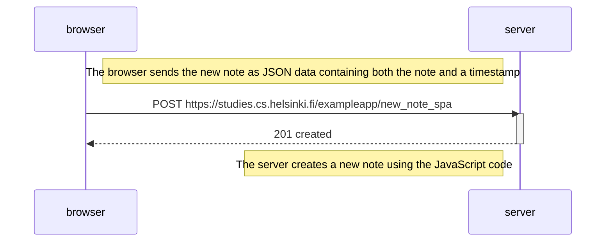

```mermaid
sequenceDiagram
    participant browser
    participant server

    Note right of browser: The browser sends the new note as JSON data containing both the note and a timestamp

    browser->>server: POST https://studies.cs.helsinki.fi/exampleapp/new_note_spa
    activate server
    server-->>browser: 201 created
    deactivate server

    Note left of server: The server creates a new note using the JavaScript code
```